# Johlfirmware #

At the moment this is just a clone of the excellent firmware [TMK][TMK]. In the
future I hope to be able to convert this firmware to rust code.

I made an attempt previously to start writing a rust firmware from scratch but
totally underestimated how hard it would be to make USB behave like a keyboard.

Long story short I tried to educate myself about USB, Rust, Arm Cortex M4 and
Teensy 3.2 specifically until I realized someone had already made TMK compile
for the Teensy 3.2. I thought this would be an excellent starting point and
decided to hack my Atreus to use the Teensy 3.2 internally instead of the A-star
micro that came with the kit. The reason I wanted this change is that it is very
bleeding edge to compile Rust to AVR and I can only manage so
much new bleeding edge stuff at once. Compiling to a Teensy 3.2 I have already
managed.

All the hard stuff is done by others. A special thanks to [flabbergast][flabbergast] that
shared the code to make TMK use [chibios][chibios] as a backend.

For now I can only share how I converted my Atreus kit to use the Teensy 3.2.

[flabbergast]: https://github.com/flabbergast

[chibios]: https://github.com/tmk/tmk_keyboard/blob/master/tmk_core/protocol/chibios/README.md

# Converting the Atreus kit to use a Teensy 3.2 #

This is how I converted my Atreus kit to use a teensy 3.2 instead of the
provided A-star micro.

## Drilling for the programming button ##

The first challenge was to make the programming button on the teensy useable.
This requires some drilling in the PCB and in the keyboard case. Luckily there
are no PCB routes where the drinning needs to be done.

In order to know where to drill I just put some Tack It roughly where the button
would meet the PCB. Then I put the teensy in place making sure everything lined
up straight. Then I just pressed so the button made a mark in the Tack it. 

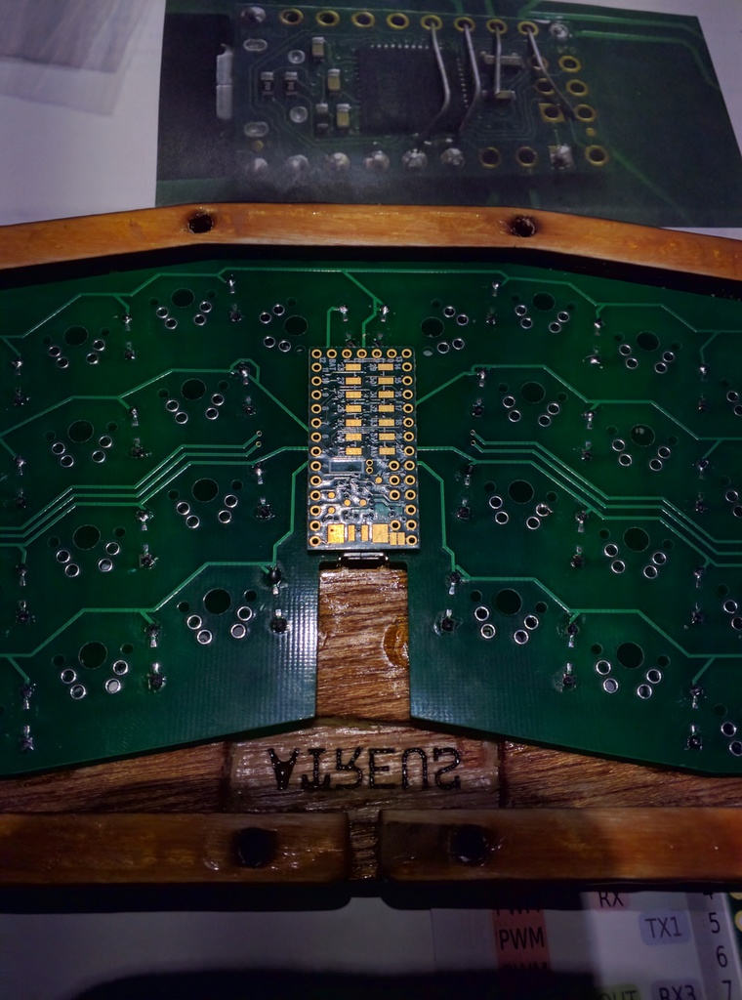
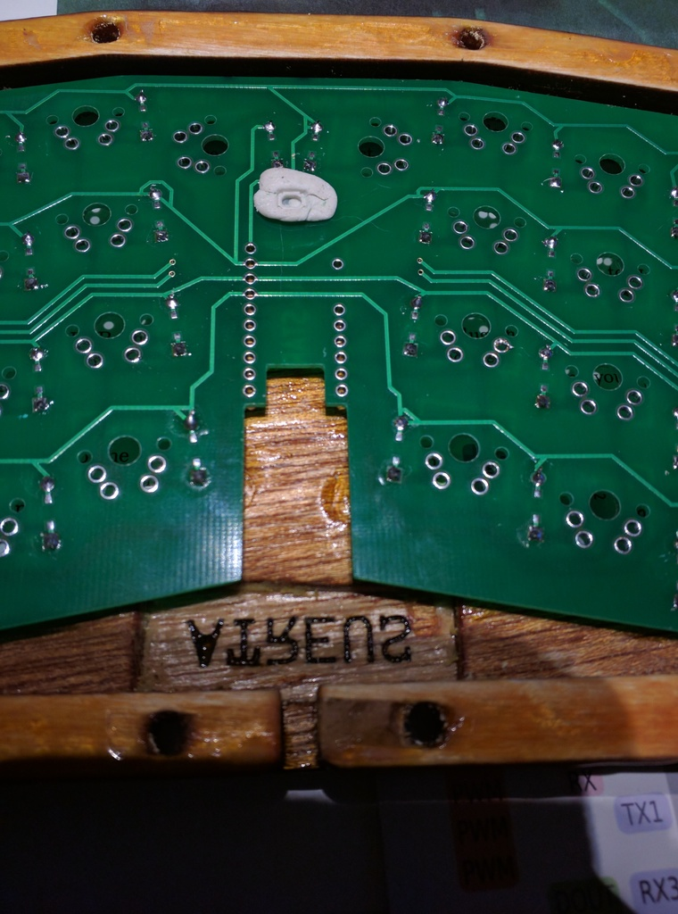

I then proceeded to drill a pilot hole with a 2mm drill.

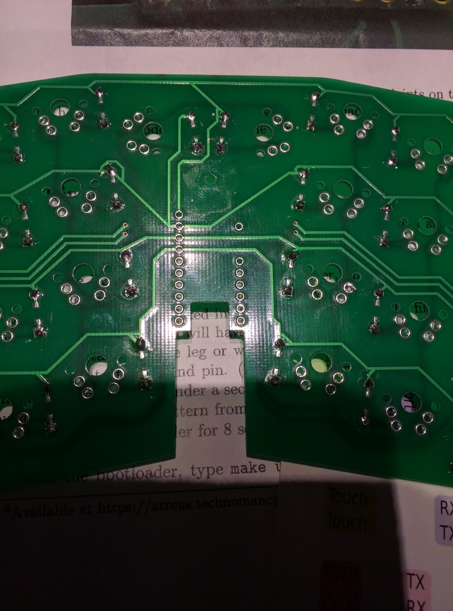

Next we need to drill a hole in the case. 

The programming hole will come out right between the large thumb buttons. In
order to avoid splintering the surface when the drill comes through I protected
it with sime tape.

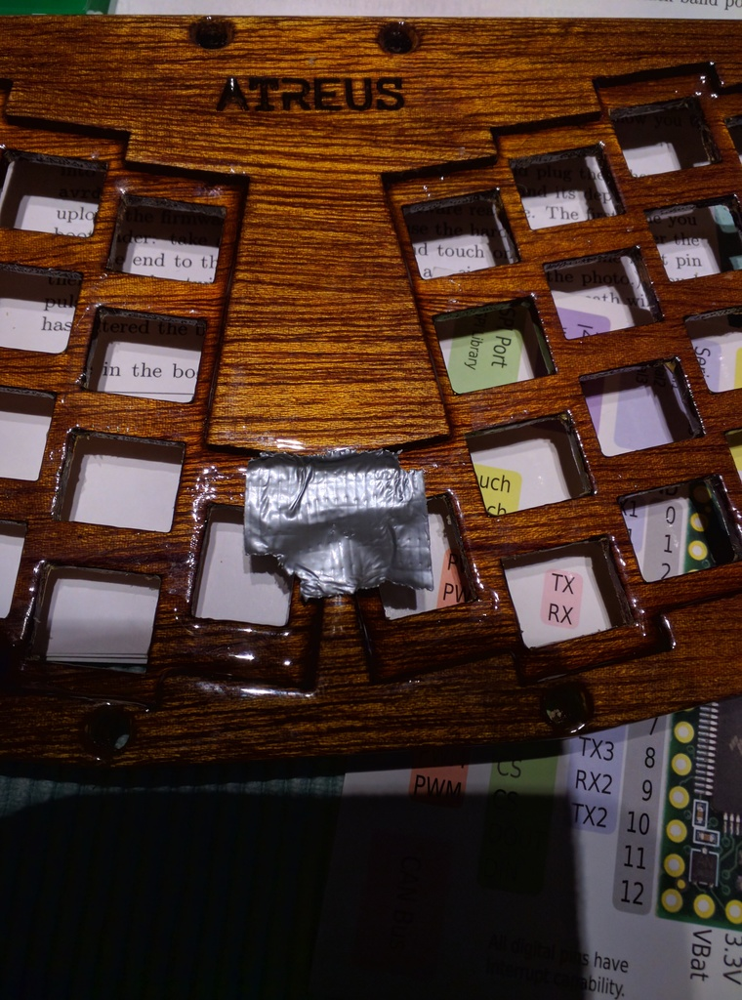

Next we need to do the actual drilling. For this step it is important that you 
put in the four corner switches in the case so that you can use them to alingn 
the PCB properly in the case.

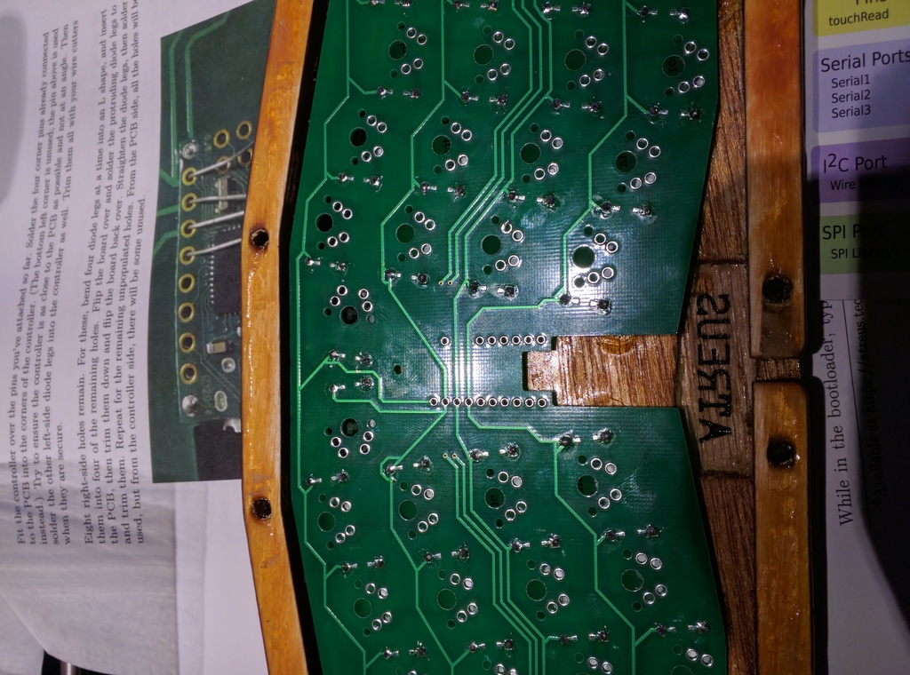

Use a 2mm drill and go through carefully using the PCB as a guide.

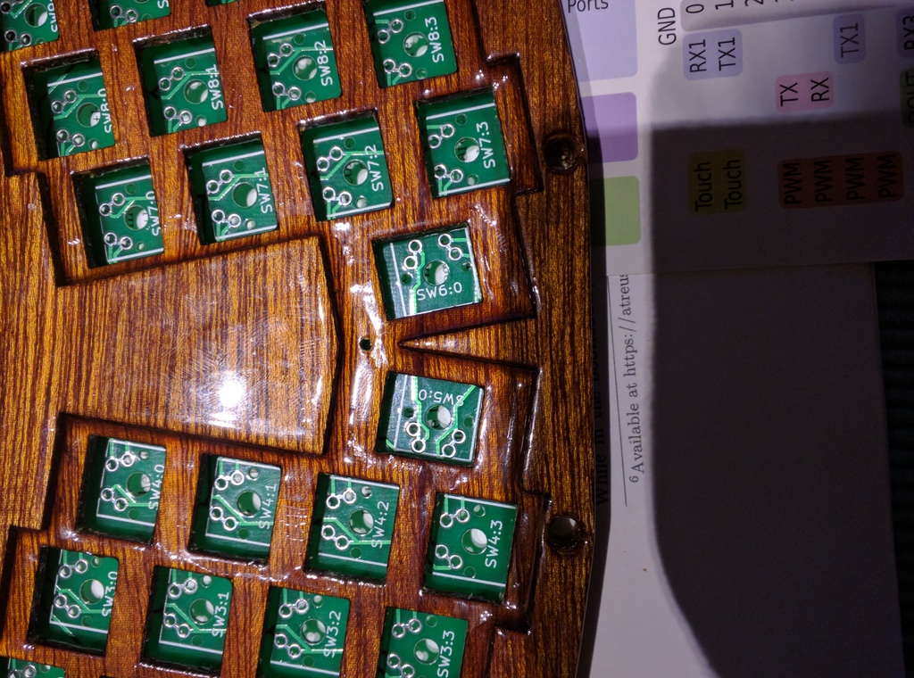

Next use a 6mm drill to make room in the PCB for the button.
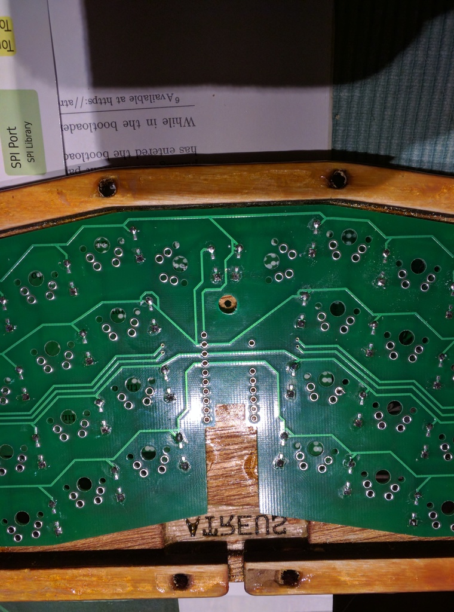

Test fit the teensy and see that everything fits and lines up as expected.
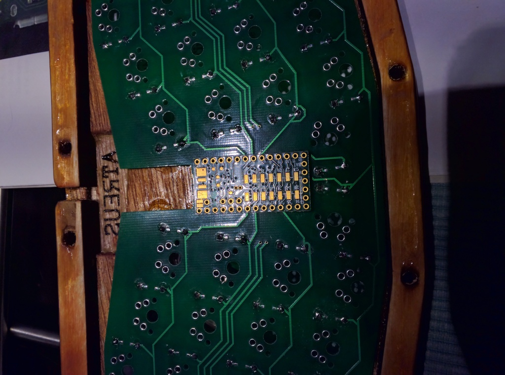

## Soldering the Teensy 3.2 ##

Next we nee to solder the teensy. The teensy is slightly wider than the A-Star
micro and the GND and 3V-pins are placed where we would like digital I/O-pins to
be. So we will have to solder in some cables and route them to where we want to
connect them.

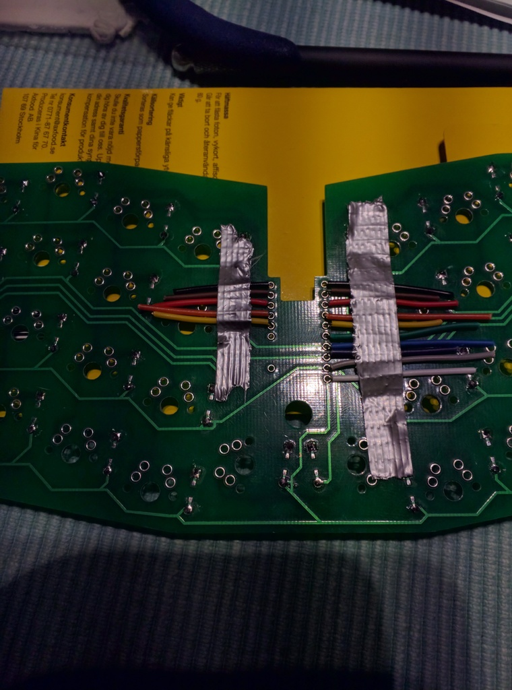

After soldering I used some isolating tape just to make sure nothing shortcuts
anything on the teensy.

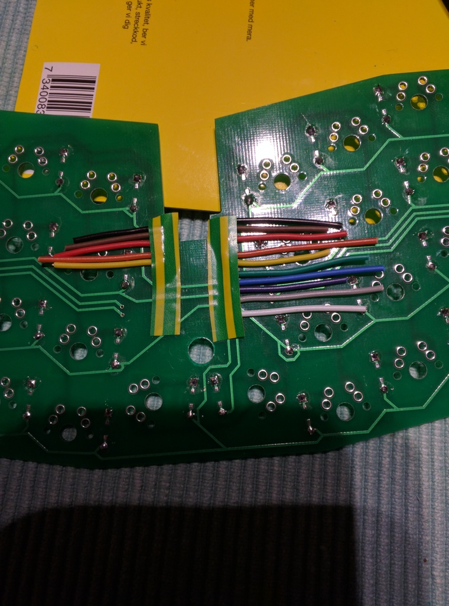

I used some duct tape to put the teensy in place before soldering the wires to
the proper pins.

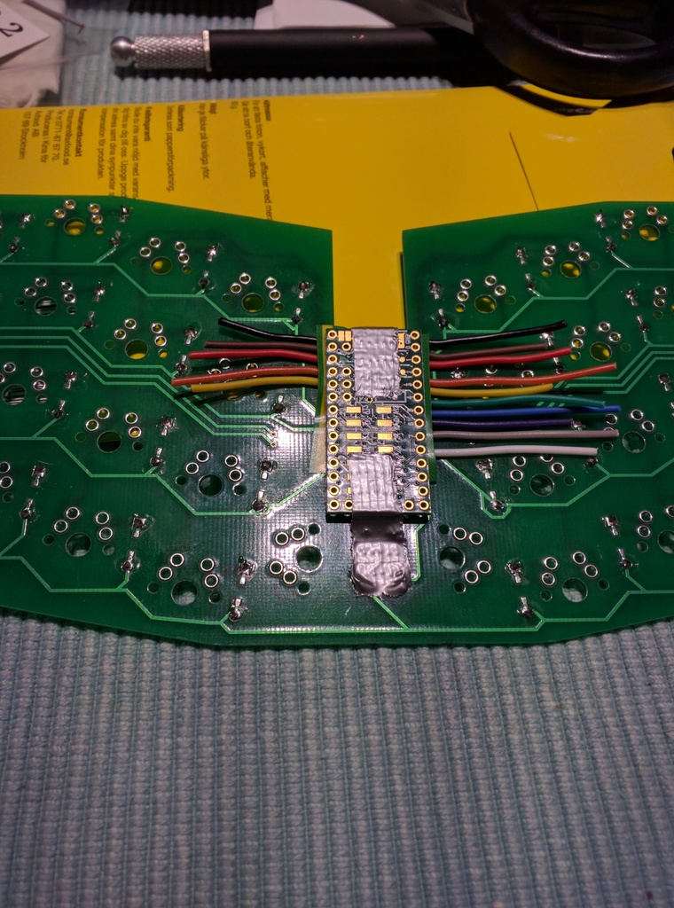

It is a bit fiddly to peel and connect the cables but here is how it should all
fit.

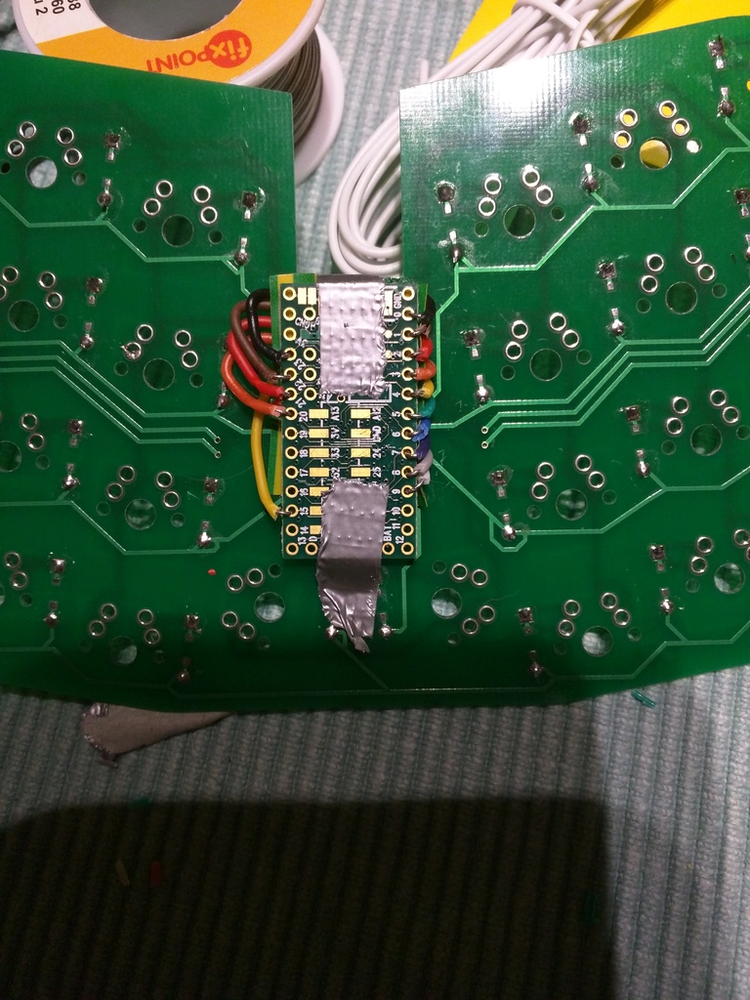

You may notice and wonder about the left yellow cable. I skipped a couple of
pins to let keep the SPI free for future use.

Finally solder all switches to the PCB. When you want to flash the teensy you
can use a pin, nail or paperclip to press the programming button.
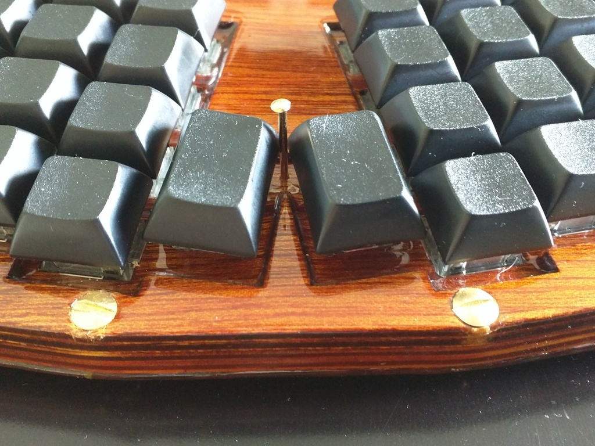

You now have an Atreus keyboard with a teensy 3.2. In theory we should be able
to strangle TMK little by little from Rust given that the Teensy has an Arm
Cortex M4 and a decent amount of flash memory and ram.

Enjoy!

[TMK]: https://github.com/tmk/ "TMK"
 
